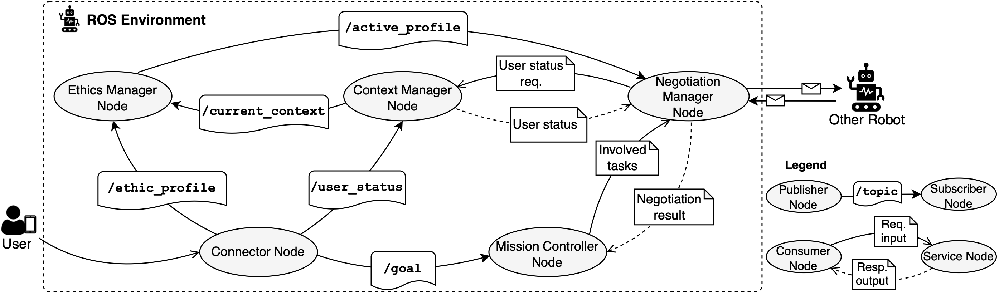

# RobEthiChor: Interruption Scenario Example

This project is an expansion of the [RobEthiChor](https://doi.org/10.48550/arXiv.2507.22664) framework. Therefore, it is a fork of the [original repository](https://github.com/gianlucafilippone/robethichor.git) and with some help of the [second repository](https://github.com/RoboChor/robethichor-ethics-based-negotiation).


This is the accompanying project to the master's thesis "Ethical Decision-Making for Service Robots". It expands the RobEthiChor framework from dealing with resource contentions between two robots each serving a user, to a resource contention of two users both requesting a service from the same robot. 

TODO scenario image? 

<!--p align="center">
  
</p-->

TODO repository structure? 

## Main changes
The following main changes were made to the original system:

- changing ethics manager and context manager to lifecycle nodes running in a specified namespace
- addition of lifecycle manager as part of the mission controller node, that can activate and deactivate the ethics and context manager nodes 
- addition of interruption handler: 
    - processes the interruption
    - signals the lifecycle manager to activate/deactivate the corresponding lifecycle nodes before/after the negotiation
    - poses the negotiation request to the negotiation manager
    - processes the negotiation result, e.g. changing mission controller's goal
- adaptation of negotiation manager: Access ethics manager and context manager for two different users (in two different namespaces)
- adaptation of negotiation engine: Remove communication with other agent, instead switch perspectives internally
- connector node receives and publishes data in two different namespaces
- integration into Gazebo 

There are additional details that were changed, but concern mainly notational differences, e.g. switching the negotiation from task level to goal level. 

### Expansion: Willingness to be interrupted

To include the willingness to be interrupted, the test data was adapted to include the user condition `end of goal`. The implementation of the utility function was then adapted to account for this special case.  

### Expansion: Multi-lateral negotiation

To accomodate multi-lateral negotiation, a third set of ethic and context manager nodes is launched and managed by the lifecycle node manager. The interuption manager is expanded to include the policy for sending the negotiation requests and combining their outcome. The negotiation request is expanded to include information about between which users the negotiation should take place. The negotiation manager dynamically reacts to this information by querying the respective data. 

## Download, installation and running on a local machine
Clone the repository:
```
git clone https://github.com/reichern/robethichor-self-negotiation.git
```

### Prerequisites
- Ubuntu 22.04
- ROS 2 Humble 
- ROS dev-tools
- Rosdep

TODO Gazebo + Tiago integration
install gazebo??? 
include robot:
sudo apt install ros-humble-tiago-simulation

### Installation
Robethichor needs to be built using `colcon` in order to run.

First create a folder for the ROS workspace, e.g.:
```
mkdir robethichor_ws
```

Move the downloaded repository into the `src` folder inside the workspace:

```
mv robethichor robethichor_ws/src
```

Install dependencies using Rosdep:
> [!NOTE]
> Rosdep must be installed and initialized before building the ROS package.
> Install Rosdep:
> ```
> apt-get update
> apt-get install python3-rosdep
> ```
>
> Initialize Rosdep:
> ```
> sudo rosdep init
> rosdep update
> ```

```
cd robethichor_ws
apt-get update
rosdep install --from-paths src -y --ignore-src
colcon build
source install/setup.bash
```

#### Gazebo and RViz Integration 

TODO 
rviz: use file in robethichor config setup.rviz or just add a GoalPanel yourself? 
gazebo: add map to tiago package :/ 

### Running experiments

The `run/` folder contains the experimental settings and the scripts required to run them. 

The following experiments are provided:
- Validation experiments: This runs the base setup of bilateral negotiation on manually crafted data. It supports Gazebo integration, and therefore provides a visualization of a negotiation scenario.
- Scalability experiments: This runs the base setup of bilateral negotiation for automatically generated tests cases with different numbers of dispositions and activated conditions. It does not provide Gazebo integration.
- Willingness to be interrupted: This runs exactly similar to the validation experiments, however with the internal inclusion of willingness to be interrupted in the decision process, therefore slighlty different results
- Multi-lateral negotiation: This runs on the manually crafted data as used in the validation and willingness to be interrupted experiment, however on triples of users instead of pairs. It conducts several bilateral negotiations and combines their outcome for the final decision. (TODO Gazebo integration??)

#### Validation Experiments
The runscript and configuration for the validation experiments can be found in the `validation/` folder. The manually crafted users are stored under  `validation/usecases`. To run the experiments: 
```
cd ../run/validation
chmod +x run_usecase.bash
./run_usecase.bash --launch true 
```
A separate terminal will open for the robot. Log files will be stored inside the `validation/results/` folder.
All configuration options can be found in the `validation/run_usecase.bash` file. The most important ones are:
- ```--gazebo <bool>```: Starts the experiment with Gazebo integration, which is set to `false` as a default. When set to `true`, first a terminal for Gazebo will open before a second one for the robot starts. 
- ```--force-config "<currently active users>" "<interrupting users>"```: Configures which negotiations should be run. As a default, the experiment will run a negotiation between each of the possible pairs of test users in each role assignment. The users are denoted as "A B C D E F G H I J". Example to run negotiations only between the first three users: ```--force-config "A B C" "A B C"```
- ```--wait <wait time>```: The wait time between test runs. Is set to `10` by default. To speed up the experiments, the value can be reduced, however it should be chosen with caution, as to not overlap the negotiations and produce faulty results, especially when running with Gazebo.

#### Scalability Experiments
The runscript and configuration for the scalability experiments can be found in the `scalability/` folder. In the folder  `scalability/test_cases`, automatically generated test cases for 10,25,50 and 100 dispositions and a condition activation of 10,25,50,75,100% are already provided.  

> [!NOTE]
> To generate new test cases, use the `scalability/generate_test_cases.py` python script:
> ```
> python3 generate_test_cases --n <num dispositions> --p <activated conditions> --c <number of cases>
> ```

To run the experiments: 

```
cd ../run/scalability_experiments
chmod +x run_experiment.bash
./run_experiment.bash --launch true
```
A separate terminal will open for the robot. Log files will be stored inside the `scalability/results/` folder.
All configuration options can be found in the `scalability/run_usecase.bash` file. The most important ones are:
- ```--force-config "<currently active users>" "<interrupting users>"```: Configures of which dimensions the negotiations should be run. As a default, the experiment will run negotiations for test cases with 10,25,50 and 100 dispositions and a condition activation of 10,25,50,75,100%. Example to run negotiations only smaller test cases of dispositions, but all condition activations: ```--force-config "10 25" "10 25 50 75 100"```
- ```--wait <wait time>```: The wait time between test runs. Is set to `10` by default. To speed up the experiments, the value can be reduced, however it should be chosen with caution, as to not overlap the negotiations and produce faulty results.

### Expansion: Willingness to be interrupted

To conduct the experiment for willingness to be interrupted, switch to the corresponding branch: 

TODO 

Then, the runscript and configuration for the experiments can be found in the `willingness_tb_interrupted/` folder. In the folder  `willingness_tb_interrupted/usecases`, the manually crafted users from the validation experiment with the adapted user status are provided.  
The experiment can be run exactly like the general validation experiment:
```
cd ../run/willingness_tb_interrupted
chmod +x run_usecase.bash
./run_usecase.bash --launch true 
```

### Expansion: Multi-lateral negotiation

To conduct the experiment for multi-lateral negotiation, switch to the corresponding branch: 

TODO 

Then, the runscript and configuration for the experiments can be found in the `multi-lateral/` folder. Since the multi-lateral experiment can use the manually crafted test users without adaptation, the test cases are not replicated in this folder and instead run on the test cases in `validation/usecases`. The test run functions similary to the validation one, however it runs on triples instead of pairs. It still runs on a list of currently active users and a list of interrupting users, just that for every test run two users are sampled from the interrupting users list, as opposed to before. To run the experiment: 

```
cd ../run/validation
chmod +x run_usecase.bash
./run_usecase.bash --launch true 
```

TODO test out!! 
The multi-lateral negotiation experiment theoretically provides Gazebo integration, however, it runs in the same world as before consisting of two rooms. Therefore it does not visualize the multi-lateral negotiation as well as the bilateral negotiation. 
TODO integrate in RViz?
## Evaluation
TODO where to find scripts, data, ... 