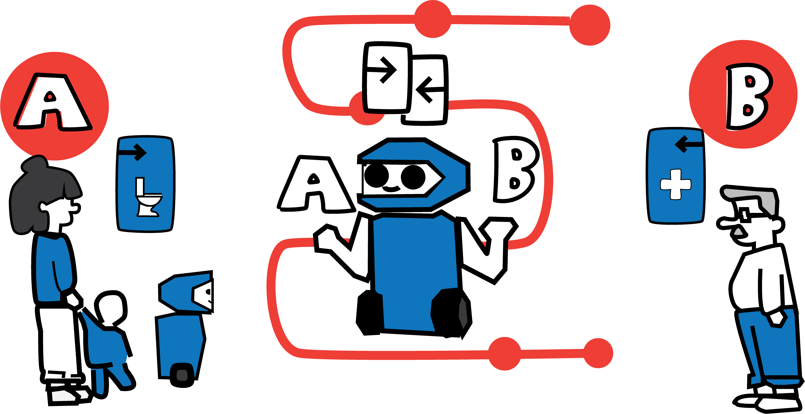

# A Self-Negotiation Framework for Ethical Decision-Making during Task Interruptions in Service Robots

This is the accompanying repository to the paper "A Self-Negotiation Framework for Ethical Decision-Making during Task Interruptions in Service Robots". It adapts the RobEthiChor framework from dealing with resource contentions between two robots each serving a user, to two users both requesting a service from the same robot. 



The project is an expansion of the [RobEthiChor](https://doi.org/10.48550/arXiv.2507.22664) framework. Therefore, it is a fork of the [original repository](https://github.com/gianlucafilippone/robethichor.git) and with some help of the [second repository](https://github.com/RoboChor/robethichor-ethics-based-negotiation).

As the robot to be simulated, the [TIAGo robot](https://pal-robotics.com/robot/tiago/) was chosen. It provides a [package](https://github.com/pal-robotics/tiago_simulation) to integrate it with Gazebo. However, at the moment the version with which this system was implemented is no longer available. The current state of this repository is not compatible with the new version of the package. Therefore, the old version is provided locally, to make the code in this repository replicable. 

The structure of the git repository is as follows: 
```
robethichor-self-negotiation
├── LICENSE
├── README.md
├── evaluation                        # evaluation scripts used in the project
├── results                           # results of the thest runs done for the project
├── robethichor                       # adapted robethichor package
├── robethichor_interfaces            # adapted robethichor interface package
├── run                               # run files for running different tests
│   ├── multi_lateral                 #     multi-lateral negotiation: only available in separate branch! 
│   ├── scalability                   #     scalability of the runtime
│   ├── validation                    #     validation of the base algorithm
│   └── willingness_tb_interrupted    #     willingness to be interrupted: only availbale in separate branch! 
├── tiago_public_sim                  # local package to build separately for the simulated robot 
└── rviz_goal_panel                   # custom rviz panel to visualize decision
```

## Main changes
The following main changes were made to the original system:

- changing ethics manager and context manager to lifecycle nodes running in a specified namespace
- addition of lifecycle manager as part of the mission controller node, that can activate and deactivate the ethics and context manager nodes 
- addition of interruption handler: 
    - processes the interruption
    - signals the lifecycle manager to activate/deactivate the corresponding lifecycle nodes before/after the negotiation
    - poses the negotiation request to the negotiation manager
    - processes the negotiation result, e.g. changing mission controller's goal
- adaptation of negotiation manager: Access ethics manager and context manager for two different users (in two different namespaces)
- adaptation of negotiation engine: Remove communication with other agent, instead switch perspectives internally
- connector node receives and publishes data in two different namespaces
- integration into Gazebo 

There are additional details that were changed, but concern mainly notational differences, e.g. switching the negotiation from task level to goal level. 

### Expansion: Willingness to be interrupted

To include the willingness to be interrupted, the test data was adapted to include the user condition `end of goal`. The implementation of the utility function was then adapted to account for this special case.  

The willingness to be interrupted is provided in the `willingness-tb-interrupted` branch of the repository. 

### Expansion: Multi-lateral negotiation

To accomodate multi-lateral negotiation, a third set of ethic and context manager nodes is launched and managed by the lifecycle node manager. The interuption manager is expanded to include the policy for sending the negotiation requests and combining their outcome. The negotiation request is expanded to include information about between which users the negotiation should take place. The negotiation manager dynamically reacts to this information by querying the respective data. 

The willingness to be interrupted is provided in the `multi-lateral` branch of the repository.  


## Download, installation and running on a local machine

### Prerequisites

The code should be run on Ubuntu 22.04 with [ROS 2 Humble](https://docs.ros.org/en/humble/Installation.html) (including dev tools!). 

To build the dependencies of the packages, Rosdep needs to be installed and initialized:

```
sudo apt-get update
sudo apt-get install python3-rosdep
sudo rosdep init
rosdep update
```

Additional packages to install:
```
sudo apt-get install gnome-terminal
sudo apt-get install jq 
sudo apt-get install ros-humble-tiago-simulation
sudo apt install ros-humble-navigation2
sudo apt install ros-humble-nav2-bringup
sudo apt install ros-humble-moveit-planners-chomp
```

### Installation

Clone the git, create a workspace and move the data from the git in the `src/` folder. 

```
git clone https://github.com/reichern/robethichor-self-negotiation.git
mkdir robethichor_ws
mkdir robethichor_ws/src
mv robethichor-self-negotiation/* robethichor_ws/src
```

To build the robethichor package, install all the dependencies and build it with `colcon`.

```
cd robethichor_ws
sudo apt-get update
rosdep install --from-paths src -y --ignore-src
colcon build
source install/setup.bash
```

To run the Gazebo simulation, it also needs to be sourced: 

```
source /usr/share/gazebo/setup.bash
```

#### Troubleshooting

When the gnome-terminals are not starting up properly, this might be a problem with the locale-gen. A possible solution: navigate to `/etc/locale.gen`, make sure that the necessary languages (e.g. `de_DE.UTF-8 UTF-8`, `en_US.UTF-8 UTF-8`) are not commented out and run :

```
sudo locale-gen
```  
Afterwards, reboot the system. 


> [!IMPORTANT]
> Currently fixing map bug with new tiago package version


### Running experiments

The `run/` folder contains the experimental settings and the scripts required to run them. 

The following experiments are provided:
- **Validation experiments**: This  experiment runs the base setup of bilateral negotiation on manually crafted data. It supports Gazebo integration, and therefore provides a visualization of a negotiation scenario.
- **Scalability experiments**: This experiment runs the base setup of bilateral negotiation for automatically generated tests cases with different numbers of dispositions and activated conditions. It does not provide Gazebo integration.
- **Willingness to be interrupted**: This experiment runs exactly like the validation experiments, however with the internal inclusion of willingness to be interrupted in the decision process, therefore slighlty different results. It supports Gazebo integration. 
- **Multi-lateral negotiation**: This runs on the manually crafted data as used in the validation and willingness to be interrupted experiment, however on triples of users instead of pairs. It conducts several bilateral negotiations and combines their outcome for the final decision. It also supports Gazebo integration. 

When running the experiments with Gazebo, make sure to have not only the robethichor workspace sourced, but also Gazebo and the tiago workspace, as mentioned above! 

#### Validation Experiments
The runscript and configuration for the validation experiments can be found in the `validation/` folder. The manually crafted users are stored under  `validation/usecases`. To run the experiments: 
```
cd src/run/validation
chmod +x run_usecase.bash
./run_usecase.bash --launch true 
```
A separate terminal will open for the robot. Log files will be stored inside the `validation/results/` folder.
All configuration options can be found in the `validation/run_usecase.bash` file. The most important ones are:
- ```--gazebo <bool>```: Whether to run the experiment with Gazebo integration, which is set to `false` as a default. When set to `true`, first a terminal for Gazebo will open before a second one for the robot starts. 
- ```--force-config "<currently active users>" "<interrupting users>"```: Configures which negotiations should be run. As a default, the experiment will run a negotiation between each of the possible pairs of test users in each role assignment. The users are denoted as "A B C D E F G H I J". Example to run negotiations only between the first three users: ```--force-config "A B C" "A B C"```
- ```--wait <wait time>```: The wait time between test runs. Is set to `10` by default. To speed up the experiments, the value can be reduced, however it should be chosen with caution, as to not overlap the negotiations and produce faulty results, especially when running with Gazebo.

#### Scalability Experiments
The runscript and configuration for the scalability experiments can be found in the `scalability/` folder. In the folder  `scalability/test_cases`, automatically generated test cases for 10,25,50 and 100 dispositions and a condition activation of 10,25,50,75,100% are already provided.  

> [!NOTE]
> To generate new test cases, use the `scalability/generate_test_cases.py` python script:
> ```
> python3 generate_test_cases --n <num dispositions> --p <activated conditions> --c <number of cases>
> ```

To run the experiments: 
```
cd src/run/scalability
chmod +x run_experiment.bash
./run_experiment.bash --launch true
```
A separate terminal will open for the robot. Log files will be stored inside the `scalability/results/` folder.
All configuration options can be found in the `scalability/run_usecase.bash` file. The most important ones are:
- ```--force-config "<currently active users>" "<interrupting users>"```: Configures the dimensions of the negotiations that will be tested. As a default, the experiment will run negotiations for test cases with 10,25,50 and 100 dispositions and a condition activation of 10,25,50,75,100%. Example to run negotiations only smaller test cases of dispositions, but all condition activations: ```--force-config "10 25" "10 25 50 75 100"```
- ```--wait <wait time>```: The wait time between test runs. Is set to `10` by default. To speed up the experiments, the value can be reduced, however it should be chosen with caution, as to not overlap the negotiations and produce faulty results.

### Expansion: Willingness to be interrupted

To conduct the experiment for willingness to be interrupted, switch to the corresponding branch: 

```
git checkout willingness-tb-interrupted
``` 

And don't forget to rebuild the package! 
Then, the runscript and configuration for the experiments can be found in the `willingness_tb_interrupted/` folder. In the folder  `willingness_tb_interrupted/usecases`, the manually crafted users from the validation experiment status are provided with adapted user conditions including the end of a goal.  
The experiment can be run exactly like the general validation experiment:
```
cd src/run/willingness_tb_interrupted
chmod +x run_usecase.bash
./run_usecase.bash --launch true 
```

### Expansion: Multi-lateral negotiation

To conduct the experiment for multi-lateral negotiation, switch to the corresponding branch: 

```
git checkout multi-lateral
``` 

And don't forget to rebuild the package! 
Then, the runscript and configuration for the experiments can be found in the `multi-lateral/` folder. Since the multi-lateral experiment can use the manually crafted test users without adaptation, the test cases are not replicated in this folder and instead run on the test cases in `validation/usecases`. The test run functions similary to the validation one, however it runs on triples instead of pairs. It still runs on a list of currently active users and a list of interrupting users, just that for every test run two users are sampled from the interrupting users list, as opposed to before. To run the experiment: 

```
cd src/run/validation
chmod +x run_usecase.bash
./run_usecase.bash --launch true 
```

The multi-lateral negotiation experiment theoretically provides Gazebo integration, however, it runs in the same world as before consisting of two rooms. Therefore it does not visualize the multi-lateral negotiation as well as the bilateral negotiation. 

## Evaluation

The data that was used for evaluation in this project is provided under the `results/` folder. The following files can be found:

- `ground_truth.csv`: Table of each possible pair of the manually created test users, and their manually calculated expected result.
- `scalability.log`: The results of the scalability tests as described in this project. 
- `validation-with_gazebo.log`: The results of the validation tests of the base algorithm with Gazebo.
- `validation-without_gazebo.log`: The results of the validation tests of the base algorithm without Gazebo.

In the expansion branches, the additonal files can be found in the same folder:

- `willingness_tb_interrupted.log`: The results of the test runs for inclusion of willingness to be interrupted. 
- `ground_truth-multi_lateral.csv`: Table of each possible trible of the manually created test users, and their manually calculated expected result.
- `results-multi_lateral.log`: The results of the test runs for multi-lateral negotiation. 

The evaluation scripts analyzing the test results can be found in the `evaluation/` folder. The followign scripts can be found:

- `users-expected_results.ods`: List of all the test users, their ethical impact and utility in each possible combination, and expected negotiation outcome in the base algorithm.
- `scalability.ipynb`: Jupyter notebook evaluating the scalability test run as described in the project. 
- `validation.ipynb`: Jupyter notebook evaluating the validation test runs with and without Gazebo, as described in the project. 

In the expansion branches, the additional files can be found in the same folder:

- `willingness_tb_interrupted.ipynb`: Jupyter notebook evaluating the the test runs for inclusion of willingness to be interrupted. 
- `multi_lateral.ipynb`: Jupyter notebook evaluating the the test runs for multi-lateral negotiation, as described in the project. 


